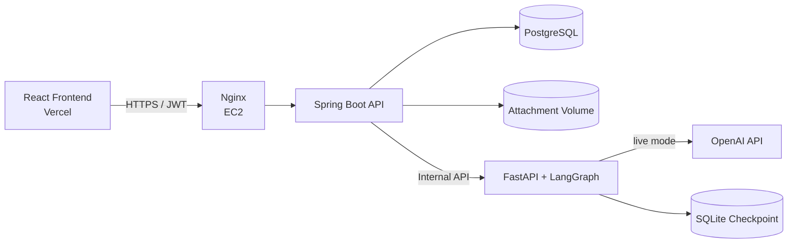

# ditto Backend

> 글로벌 비동기 협업에서 메시지를 단순한 문장이 아닌, 모두가 같은 의미로 이해하는 업무 약속으로 변환하는 백엔드입니다.

`ditto`는 시차, 언어, 문화적 표현 차이로 생기는 협업 오해를 줄이기 위한 메신저 기반 서비스입니다. 일반적인 1:1 메시징에 더해 AI가 모호한 표현을 검토하고, 업무·담당자·기한·기대 결과를 구조화한 공통 이해 카드와 합의 기록을 제공합니다.

## 서비스 구성



- 외부 클라이언트는 Spring Boot API만 호출합니다.
- AI 서비스와 체크포인트 저장소는 Docker 내부 네트워크에서만 사용합니다.
- 모든 날짜와 시간은 DB에 UTC로 저장하고, 사용자 IANA 타임존을 기준으로 변환합니다.
- API 인증은 JWT Bearer 방식입니다.

## 핵심 기능

| 영역 | 구현 내용 |
| --- | --- |
| 인증 | 이메일 6자리 인증, 회원가입, 로그인, JWT 발급 및 검증 |
| 온보딩 | 프로필, 프로필 사진, 역할, 선호 언어, 타임존, 근무시간, 근무요일 |
| 워크스페이스 | 생성, 목록, 상세, 멤버 조회, OWNER 소프트 삭제, 멤버별 근무 설정 |
| 초대 | 이메일 다중 초대, 공유 초대 링크, 초대 미리보기 및 수락 |
| 메신저 | 사용자 검색, 1:1 대화방, 메시지 목록·전송·읽음 처리, 미확인 메시지 수 |
| 메시지 번역 | 수신자의 선호 언어로 자동 번역, 원문과 번역문 동시 제공, 번역 실패 시 원문 전송 보장 |
| 첨부파일 | 업로드, 메타데이터 조회, 권한 검증, 다운로드 |
| AI 검토 | 모호성 탐지, 추가 질문, 답변 반영, 검토 내용 수정, 확정 메시지 전송 |
| 공통 이해 카드 | 업무·담당자·기한·기대 결과 구조화, 수신자 응답, 발신자 수정 및 재확인 |
| 합의 기록 | 대화별 합의 상태와 revision 이력, 첨부파일 근거 스냅샷 조회 |

현재 MVP에서는 채널·그룹 채팅, 메시지 수정·삭제, WebSocket 기반 실시간 전송을 지원하지 않습니다.

## 기술 스택

### Backend

- Java 21
- Spring Boot 3.5.16
- Spring Security, OAuth2 Resource Server
- Spring Data JPA, Bean Validation
- PostgreSQL 17, Flyway
- springdoc-openapi 2.8.17
- Gradle 8.14.3 Wrapper

### AI service

- Python 3.12+
- FastAPI, Uvicorn
- LangGraph, SQLite Checkpoint
- OpenAI API

### Infrastructure

- Docker, Docker Compose
- AWS EC2, Nginx, Let's Encrypt
- Vercel Frontend

## 프로젝트 구조

```text
.
├── src/main/java/com/likelion/asyncalign
│   ├── auth/           # 이메일 인증, 회원가입, 로그인, JWT
│   ├── user/           # 프로필, 근무 컨텍스트, 사용자 검색
│   ├── workspace/      # 워크스페이스와 멤버
│   ├── invitation/     # 이메일·링크 초대
│   ├── messenger/      # 1:1 대화, 메시지, 읽음, 번역
│   ├── attachment/     # 첨부파일과 접근 권한
│   ├── alignment/      # AI 검토, 공통 이해 카드, 합의 기록
│   ├── storage/        # 로컬 볼륨 파일 저장
│   └── global/         # 보안, OpenAPI, 예외 처리, 공통 설정
├── src/main/resources
│   ├── application.yml
│   └── db/migration/   # Flyway 마이그레이션
├── ai-service/         # FastAPI + LangGraph 내부 AI 서비스
├── docker-compose.yml
├── Dockerfile
└── .env.example
```

각 도메인은 `api`, `application`, `domain`, `dto` 계층으로 분리되어 있습니다.

## 로컬 실행

### 1. 준비 사항

- Docker Desktop
- Docker Compose v2
- 실제 AI 호출 시 OpenAI API Key
- 실제 인증 메일 발송 시 SMTP 계정과 앱 비밀번호

### 2. 환경변수 생성

PowerShell:

```powershell
Copy-Item .env.example .env
```

macOS/Linux:

```bash
cp .env.example .env
```

최소한 아래 값은 개발 환경에 맞게 변경합니다.

```dotenv
JWT_SECRET=32바이트_이상의_충분히_긴_무작위_문자열
DITTO_INTERNAL_API_KEY=백엔드와_AI_서비스가_공유할_내부_키

MAIL_USERNAME=발송용_Gmail_주소
MAIL_PASSWORD=Google_앱_비밀번호
MAIL_FROM=발송용_Gmail_주소

DITTO_LLM_MODE=mock
OPENAI_API_KEY=
```

`mock` 모드는 OpenAI 키 없이 고정 응답으로 전체 흐름을 검증합니다. 실제 모델을 호출하려면 다음과 같이 변경합니다.

```dotenv
DITTO_LLM_MODE=live
OPENAI_API_KEY=sk-...
DITTO_OPENAI_MODEL=o3-mini
DITTO_TRANSLATION_MODEL=gpt-4o-mini
```

### 3. 전체 서비스 시작

```powershell
docker compose up -d --build
docker compose ps
```

기본 접속 주소:

| 대상 | 주소 |
| --- | --- |
| Backend API | `http://localhost:8080` |
| Swagger UI | `http://localhost:8080/swagger-ui.html` |
| OpenAPI JSON | `http://localhost:8080/v3/api-docs` |
| PostgreSQL | `localhost:5432` |

호스트의 8080 포트를 이미 사용 중이라면 `.env`에 `BACKEND_PORT=8081`을 추가합니다. 이 경우 Swagger 주소도 `http://localhost:8081/swagger-ui.html`로 바뀝니다.

### 4. 로그와 종료

```powershell
docker compose logs -f backend
docker compose logs -f ai
docker compose down
```

DB, 첨부파일, AI 체크포인트는 Docker named volume에 유지됩니다. 저장 데이터까지 제거해야 할 때만 `docker compose down -v`를 사용합니다.

## 주요 환경변수

| 변수 | 설명 | 기본값 |
| --- | --- | --- |
| `BACKEND_PORT` | 호스트에 공개할 백엔드 포트 | `8080` |
| `DB_URL` | PostgreSQL JDBC URL | `jdbc:postgresql://localhost:5432/async_align` |
| `JWT_SECRET` | JWT 서명 키, 32바이트 이상 권장 | 로컬 개발값 |
| `CORS_ALLOWED_ORIGINS` | 허용할 프론트엔드 Origin, 쉼표로 구분 | `localhost:3000,5173` |
| `PUBLIC_BASE_URL` | 초대 링크와 파일 URL에 사용할 백엔드 공개 주소 | `http://localhost:8080` |
| `FRONTEND_BASE_URL` | 초대 메일에 사용할 프론트엔드 주소 | `http://localhost:5173` |
| `EMAIL_VERIFICATION_REQUIRED` | 회원가입 전 이메일 인증 필수 여부 | `true` |
| `MAIL_USERNAME` | SMTP 발송 계정 | 없음 |
| `MAIL_PASSWORD` | SMTP 앱 비밀번호 | 없음 |
| `UPLOAD_ROOT` | 첨부파일 저장 경로 | `./data/uploads` |
| `DITTO_LLM_MODE` | `mock` 또는 `live` | Compose에서는 `mock` |
| `DITTO_OPENAI_MODEL` | AI 검토 모델 | `o3-mini` |
| `DITTO_TRANSLATION_MODEL` | 메시지·카드 번역 모델 | `gpt-4o-mini` |
| `OPENAI_API_KEY` | `live` 모드 OpenAI 인증 키 | 없음 |
| `DITTO_INTERNAL_API_KEY` | Spring과 FastAPI 사이의 내부 인증 키 | 로컬 개발값 |

운영 환경에서는 `.env`를 저장소에 커밋하지 않고 JWT, SMTP, OpenAI, 내부 API 키를 별도 Secret으로 관리해야 합니다.

## API

모든 외부 API는 `/api/v1`을 prefix로 사용합니다. 보호된 API는 다음 헤더가 필요합니다.

```http
Authorization: Bearer {accessToken}
```

### API 그룹

| 그룹 | 주요 경로 | 설명 |
| --- | --- | --- |
| Auth | `/api/v1/auth/**` | 이메일 인증, 회원가입, 로그인 |
| Users | `/api/v1/users/**` | 내 정보, 프로필, 근무 설정, 역할, 사용자 검색 |
| Workspaces | `/api/v1/workspaces/**` | 워크스페이스, 멤버, 근무 설정 |
| Invitations | `/api/v1/workspace-invitations/**` | 초대 미리보기와 수락 |
| Conversations | `/api/v1/conversations/**` | 1:1 대화방, 메시지, 읽음 처리 |
| Attachments | `/api/v1/attachments/**` | 첨부파일 조회와 다운로드 |
| AI reviews | `/api/v1/ai-reviews/**` | AI 검토 조회, 수정, 답변, 확정 전송 |
| Understanding cards | `/api/v1/understanding-cards/**` | 공통 이해 카드 응답과 revision |
| Agreement logs | `/api/v1/conversations/{id}/agreement-logs` | 대화별 합의 이력 |

요청·응답 스키마와 전체 엔드포인트는 OpenAPI 3.0 문서를 기준으로 합니다.

- 로컬 Swagger UI: `http://localhost:8080/swagger-ui.html`
- 로컬 OpenAPI JSON: `http://localhost:8080/v3/api-docs`
- 배포 Swagger UI: [https://184-192-51-194.nip.io/swagger-ui.html](https://184-192-51-194.nip.io/swagger-ui.html)
- 배포 API Base URL: `https://184-192-51-194.nip.io`

보호된 API를 Swagger에서 테스트할 때는 로그인 응답의 `accessToken`을 우측 상단 `Authorize`에 입력합니다. `Bearer` 접두사는 Swagger 설정에서 자동으로 붙습니다.

## 주요 처리 흐름

### 회원가입

1. 이메일 인증 코드를 요청합니다.
2. 메일로 받은 6자리 코드를 확인합니다.
3. 확인 응답의 `emailVerificationToken`으로 회원가입합니다.
4. 로그인 후 발급된 JWT로 온보딩과 워크스페이스 API를 호출합니다.

### AI 검토와 합의

1. 발신자가 원문과 첨부파일을 AI 검토 API에 제출합니다.
2. Spring Backend가 사용자·대화·첨부 권한을 검증합니다.
3. 내부 FastAPI 서비스가 모호한 시간, 요청 의도, 결정 상태를 분석합니다.
4. 추가 확인이 필요하면 질문을 반환하고, 발신자의 답변으로 LangGraph 세션을 재개합니다.
5. 확정된 내용을 메시지와 공통 이해 카드로 저장합니다.
6. 수신자의 동의, 기한 조정, 설명 요청과 발신자의 revision을 합의 기록에 남깁니다.

### 일반 메시지 번역

1. 메시지 전송 시 수신자의 `preferredLanguage`를 확인합니다.
2. 원문 언어와 대상 언어가 다르면 내부 번역 API를 호출합니다.
3. 응답에는 `sourceLanguage`, `targetLanguage`, `translatedContent`가 포함됩니다.
4. 번역 서비스가 실패하거나 제한 시간 안에 응답하지 않아도 원문 메시지는 정상 전송됩니다.

## 테스트

### Spring Backend

```powershell
.\gradlew.bat test
```

macOS/Linux:

```bash
./gradlew test
```

### AI service

`uv`가 설치되어 있다면:

```bash
cd ai-service
uv sync --dev
uv run pytest
uv run ruff check src tests
```

Windows에서 저장소 경로에 한글이 포함되어 Gradle Test Worker의 `ClassNotFoundException`이 발생하면 영문 경로에서 실행하거나 임시 드라이브를 연결합니다.

```powershell
subst X: "현재 저장소의 절대 경로"
X:
.\gradlew.bat test
subst X: /D
```

## 데이터베이스

- Flyway가 애플리케이션 시작 시 마이그레이션을 자동 적용합니다.
- Hibernate는 `ddl-auto=validate`로 스키마와 엔티티의 일치 여부만 검증합니다.
- 날짜와 시간은 UTC 기준으로 저장합니다.
- 기존 마이그레이션 파일은 수정하지 않고 다음 버전의 새 파일을 추가합니다.
- 워크스페이스 삭제는 OWNER만 수행할 수 있으며, 데이터 추적을 위해 소프트 삭제합니다.

## 배포 시 확인 사항

- `PUBLIC_BASE_URL`은 사용자가 접근할 수 있는 HTTPS 백엔드 주소로 설정합니다.
- `FRONTEND_BASE_URL`과 `CORS_ALLOWED_ORIGINS`에는 실제 Vercel 주소를 등록합니다.
- Nginx는 HTTPS 종료와 Spring Boot 포트로의 reverse proxy를 담당합니다.
- PostgreSQL과 AI 서비스 포트는 외부에 공개하지 않습니다.
- 첨부파일과 PostgreSQL volume이 인스턴스 재시작 후에도 유지되는지 확인합니다.
- 배포 후 Swagger, 이메일 인증, 파일 업로드, AI `live` 모드를 각각 검증합니다.

현재 프론트엔드: [https://fe-nu-seven.vercel.app](https://fe-nu-seven.vercel.app)
